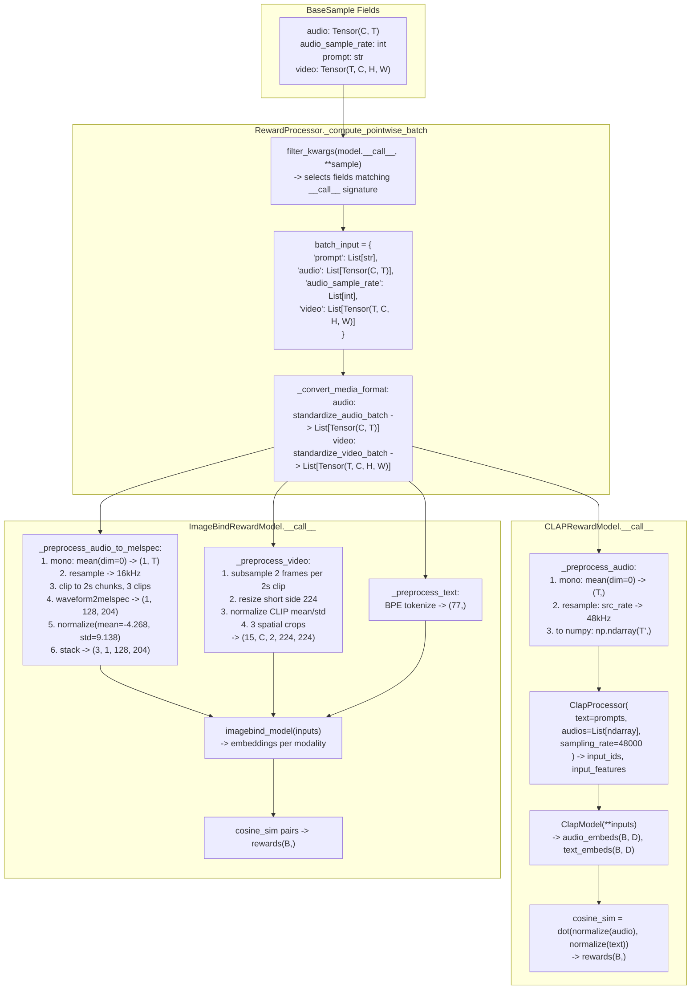

# Step 11 -- Audio Reward Models (Data Flow + Code Framework)

## End-to-End Data Flow



## Critical Data Flow Details

### How `audio_sample_rate` reaches the reward model

The `filter_kwargs` mechanism in `_compute_pointwise_batch` ([reward_processor.py:155](src/flow_factory/rewards/reward_processor.py)) works by:
1. Unpacking `batch_samples[0]` (a `BaseSample` dataclass) as `**kwargs`
2. Inspecting the model's `__call__` signature to find matching parameter names
3. Building `batch_input[k] = [getattr(s, k) for s in batch_samples]`

If `__call__` declares `audio_sample_rate`, it receives `List[int]` (e.g., `[24000, 24000, ...]`). All values are identical within a batch from the same adapter, so take `audio_sample_rate[0]`.

### CLAP: audio tensor transformations

| Stage | Shape | Type | Range | Rate |
|-------|-------|------|-------|------|
| BaseSample.audio | (C, T) C in {1,2} | torch.Tensor float32 | [-1, 1] | audio_sample_rate (e.g. 24000) |
| After standardize_audio_batch | (C, T) | torch.Tensor float32 | [-1, 1] | same |
| After mono downmix | (T,) | torch.Tensor float32 | [-1, 1] | same |
| After resample to 48kHz | (T',) where T'=T*48000/src_rate | torch.Tensor float32 | [-1, 1] | 48000 |
| To numpy | (T',) | np.ndarray float32 | [-1, 1] | 48000 |
| ClapFeatureExtractor output | input_features: (B, 1, freq, time) | torch.Tensor | normalized | N/A |

Key: **ClapFeatureExtractor does NOT resample** -- it only logs a warning if `sampling_rate != 48000`. We MUST resample ourselves before calling the processor.

### ImageBind: audio tensor transformations

| Stage | Shape | Type | Notes |
|-------|-------|------|-------|
| BaseSample.audio | (C, T) | Tensor float32 | e.g. C=1, T=24000*duration |
| Mono + resample to 16kHz | (1, T') | Tensor float32 | T'=16000*duration |
| Clip to 2s chunks (3 clips) | 3x (1, 32000) | Tensor float32 | pad/truncate each to 32000 samples |
| waveform2melspec per clip | (1, 128, 204) | Tensor float32 | fbank(frame_shift=10ms, frame_length=25ms, 128 bins) |
| Normalize(mean=-4.268, std=9.138) | (1, 128, 204) | Tensor float32 | Like a 1-channel image |
| Stack clips per sample | (3, 1, 128, 204) | Tensor float32 | num_clips=3 |
| Stack batch | (B, 3, 1, 128, 204) | Tensor float32 | Final model input |

### ImageBind: video tensor transformations

| Stage | Shape | Type | Notes |
|-------|-------|------|-------|
| BaseSample.video | (T, C, H, W) | Tensor float32 | e.g. T=81, C=3, H=480, W=848 |
| Sample 5 clips of 2s, 2 frames each | 5x (C, 2, H, W) | Tensor float32 | Temporal subsample |
| Resize short side to 224 | 5x (C, 2, 224, W') | Tensor float32 | Aspect-preserving |
| Normalize CLIP mean/std | 5x (C, 2, 224, W') | Tensor float32 | mean=(0.48, 0.46, 0.41), std=(0.27, 0.26, 0.28) |
| 3 spatial crops (224x224) | 15x (C, 2, 224, 224) | Tensor float32 | Left/center/right |
| Stack | (15, C, 2, 224, 224) | Tensor float32 | Per sample |
| Stack batch | (B, 15, C, 2, 224, 224) | Tensor float32 | Final model input |

---

## Implemented Models

### 1. CLAPRewardModel -- `src/flow_factory/rewards/clap.py`

- Audio-text alignment reward using LAION CLAP via HuggingFace `transformers.ClapModel`
- Zero additional dependencies
- Cosine similarity between audio (48 kHz mono) and text embeddings

### 2. ImageBindRewardModel -- `src/flow_factory/rewards/imagebind_reward.py`

- Audio-video semantic alignment reward using Meta ImageBind
- Top-level imports with `try/except ImportError` guard + CC-BY-NC-SA 4.0 license warning
- Supports modes: `audio_video`, `text_audio`, `text_video`, `all`
- Audio: 16 kHz mono, 2s clips, mel-spectrogram, normalized
- Video: temporal subsample, resize short side 224, CLIP normalize, 3 spatial crops

### 3. Registry -- `src/flow_factory/rewards/registry.py`

```python
'clap': 'flow_factory.rewards.clap.CLAPRewardModel',
'imagebind': 'flow_factory.rewards.imagebind_reward.ImageBindRewardModel',
```

### 4. YAML -- `examples/grpo/lora/ltx2_t2av.yaml`

Replaced PickScore with CLAP + ImageBind rewards. `model_name_or_path` and `mode` are captured into `extra_kwargs` via `ArgABC.from_dict()`.

### Key Constraints

- `ClapFeatureExtractor` does NOT resample -- only warns. Resample must happen in `_preprocess_audio`.
- ImageBind mel-spectrogram uses `torchaudio.compliance.kaldi.fbank` (requires `torchaudio>=2.4.0`, already in deps).
- ImageBind video preprocessing replicates `pytorchvideo` transforms in pure PyTorch.
- `audio_sample_rate` flows through `filter_kwargs` automatically -- no infra changes needed.
