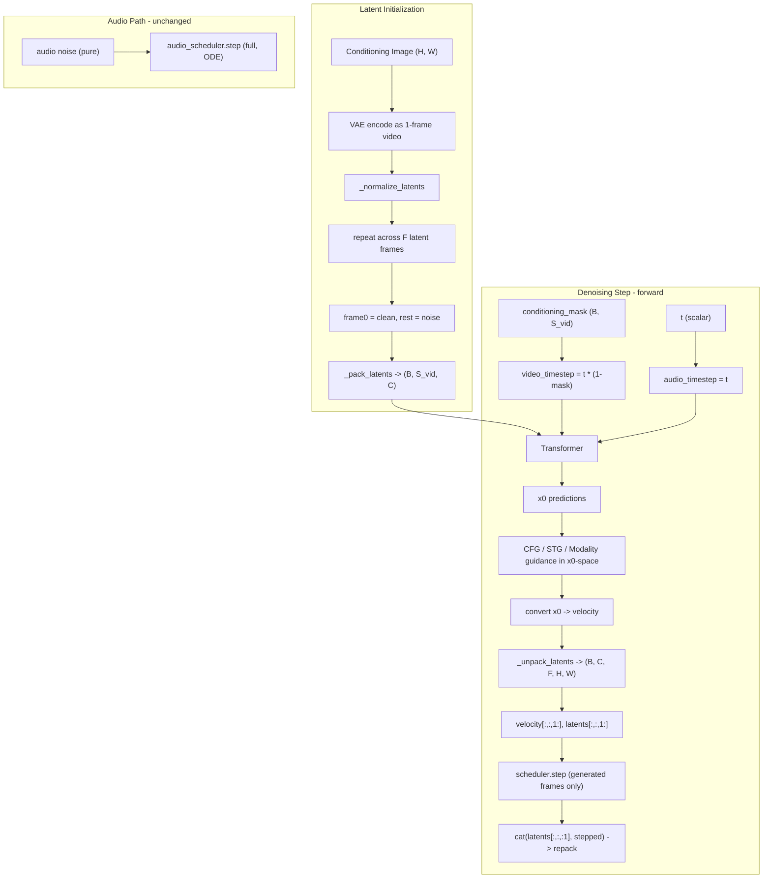

# Step 12 -- LTX2 I2AV Adapter (Image-to-Audio-Video)

## Mechanism (from `pipeline_ltx2_image2video.py`)

Image conditioning works through three reinforcing layers:

1. **Latent initialization**: VAE-encode image as 1-frame video, repeat across time, mask-blend with noise (`frame0 = clean, rest = noise`)
2. **Timestep masking**: `video_timestep = t * (1 - conditioning_mask)` -- conditioned tokens see timestep 0 in the transformer
3. **First-frame preservation**: scheduler step runs only on frames `1:`, frame 0 is preserved exactly each step

Audio is NOT conditioned by the image -- full noise init, scalar timestep, normal scheduling.



---

## Design: Flat Hierarchy (Adapter + Sample)

**Adapter**: `LTX2_I2AV_Adapter(BaseAdapter)` — per constraint #12, all model
adapters MUST inherit directly from `BaseAdapter`, never from another adapter.

**Sample**: `LTX2I2AVSample(I2AVSample)` — per constraint #14, model-specific
samples MUST inherit from the appropriate task-level sample, never from another
model-specific sample. `I2AVSample` is a task-level class defined in
`samples/samples.py` that inherits from `ImageConditionSample`, providing
`condition_images` and its standardization/hashing logic. `LTX2I2AVSample` then
adds LTX2-specific fields (connectors, generation shape, conditioning mask).

Shared logic with `LTX2_T2AV_Adapter` (encode_prompt, decode_latents, RoPE setup,
guidance computation, velocity/x0 conversion) is handled via **code duplication**.
Each adapter is a self-contained unit — no `_common.py` helper module.

---

## Conditioning Mask Semantics

The conditioning mask tells the transformer and scheduler which latent tokens are
conditioned (image frame) vs generated (denoised):

| Stage | Shape | Description |
|-------|-------|-------------|
| Before packing | `(B, 1, F, H, W)` | `mask[:, :, 0] = 1.0` (frame 0 conditioned), rest `0.0` |
| After `_pack_latents + squeeze(-1)` | `(B, S_vid)` | Same token layout as packed video latents |
| After CFG duplication (inside `forward()`) | `(2B, S_vid)` | `torch.cat([cm, cm])` along batch dim |

- Value `1.0` = conditioned token → timestep zeroed, scheduler skips
- Value `0.0` = generated token → full timestep, scheduler steps normally

The mask is created inside `prepare_latents()` and remains constant throughout the
denoising loop. It is passed to `forward()` as single-batch `(B, S_vid)` at each
step; CFG duplication to `(2B, S_vid)` happens internally inside `forward()`,
consistent with the T2AV convention where all CFG batching is internal.

---

## Sample Dataclasses

### Task-level: `I2AVSample` (NEW in `samples/samples.py`)

```python
@dataclass
class I2AVSample(ImageConditionSample):
    """Image-to-Audio-Video sample output."""
    pass
```

Inherits from `ImageConditionSample`, which provides:
- `condition_images: Optional[ImageBatch]` with standardization to `List[torch.Tensor]`
- `_id_fields` extended with `'condition_images'`
- `__post_init__` canonicalization and `_hash_id_fields` for identity hashing

Audio fields (`audio`, `audio_sample_rate`) are already on `BaseSample`.

### Model-specific: `LTX2I2AVSample` (in `ltx2_i2av.py`)

Since `LTX2I2AVSample(I2AVSample)` does NOT inherit from `LTX2Sample(T2AVSample)`,
it must **redeclare** all LTX2-specific fields. This is deliberate code duplication
per the flat hierarchy constraint #14.

```python
@dataclass
class LTX2I2AVSample(I2AVSample):
    """Output class for LTX2 image-to-audio-video adapter."""
    _shared_fields: ClassVar[frozenset[str]] = frozenset({
        'height', 'width', 'num_frames', 'frame_rate', 'video_seq_len',
        'conditioning_mask',
        'latent_index_map', 'log_prob_index_map',
    })

    # Generation shape
    num_frames: Optional[int] = None
    frame_rate: Optional[float] = None

    # Split point: unified latents[:, :video_seq_len] = video, rest = audio
    video_seq_len: Optional[int] = None

    # I2AV-specific: conditioning mask from prepare_latents
    conditioning_mask: Optional[torch.Tensor] = None  # (S_vid,) packed mask

    # Connector outputs (video/audio text embeddings, cached from preprocessing)
    connector_prompt_embeds: Optional[torch.Tensor] = None        # (seq, D_video)
    connector_audio_prompt_embeds: Optional[torch.Tensor] = None  # (seq, D_audio)
    connector_attention_mask: Optional[torch.Tensor] = None       # (seq,)

    # Negative prompt connector outputs (for CFG during training forward)
    negative_connector_prompt_embeds: Optional[torch.Tensor] = None
    negative_connector_audio_prompt_embeds: Optional[torch.Tensor] = None
    negative_connector_attention_mask: Optional[torch.Tensor] = None
```

Inherited from `ImageConditionSample` via `I2AVSample`:
- `condition_images`, `_id_fields`, `__post_init__`, `_hash_id_fields`

Inherited from `BaseSample`:
- `audio`, `audio_sample_rate`, `video`, `image`, trajectory fields, prompt fields

---

## Duplicated Methods (from T2AV)

The following methods are duplicated from `LTX2_T2AV_Adapter` into
`LTX2_I2AV_Adapter`. Each adapter is a self-contained unit.

| Method | Description |
|--------|-------------|
| `_encode_text` | Gemma3 tokenization + hidden-state stacking |
| `encode_prompt` | Full prompt encoding: `_encode_text` + optional enhance + connectors + CFG split |
| `_enhance_prompt_batch` | Prompt enhancement via Gemma3 (see I2AV difference below) |
| `_create_audio_scheduler` | Clone video scheduler config with `dynamics_type='ODE'` |
| `decode_latents` | Unpack + denormalize + VAE decode for video and audio |
| `convert_velocity_to_x0` | `sample - velocity * sigma` |
| `convert_x0_to_velocity` | `(sample - x0) / sigma` |
| `_check_inputs` | Validation (extended for I2AV, see section below) |

### `enhance_prompt` — T2AV vs I2AV

The official I2V pipeline's `enhance_prompt` passes `image` into the processor with
a **multimodal** chat message, unlike T2V which is text-only:

```python
# T2AV (text-only):
messages = [
    {"role": "system", "content": system_prompt},
    {"role": "user", "content": f"user prompt: {prompt}"},
]
model_inputs = pipeline.processor(text=template, return_tensors="pt")

# I2AV (image-conditioned):
messages = [
    {"role": "system", "content": system_prompt},
    {"role": "user", "content": [
        {"type": "image"},
        {"type": "text", "text": f"User Raw Input Prompt: {prompt}."},
    ]},
]
model_inputs = pipeline.processor(text=template, images=image, return_tensors="pt")
```

The I2AV adapter's `_enhance_prompt_batch` duplicates the T2AV version but adds an
`image` parameter. When `image is None`, the text-only path is used (same as T2AV).

---

## Files to Create / Modify

### 0. MODIFY: `src/flow_factory/samples/samples.py`

Add `I2AVSample(ImageConditionSample)` and export in `__all__`:

```python
@dataclass
class I2AVSample(ImageConditionSample):
    """Image-to-Audio-Video sample output."""
    pass
```

### 1. NEW: `src/flow_factory/models/ltx2/ltx2_i2av.py`

Contains `LTX2I2AVSample` dataclass and `LTX2_I2AV_Adapter(BaseAdapter)`.

Key methods (I2AV-specific, others duplicated from T2AV):

- **`load_pipeline()`** -- Load `LTX2ImageToVideoPipeline` (not `LTX2Pipeline`). Same pretrained weights, different pipeline class that provides `prepare_latents(image=...)`

- **`encode_image(images, condition_image_size, height, width, device)`** -- Preprocess images via `pipeline.video_processor.preprocess` at generation `(height, width)`. `condition_image_size` is in the signature for API compatibility but unused. Return `{'condition_images': preprocessed_tensor}`. (VAE encoding deferred to `prepare_latents` in `inference()`)

- **`forward(..., conditioning_mask=None)`** -- I2AV-specific behavior:
  - CFG-double `conditioning_mask` internally: `cm = torch.cat([cm, cm])` when `do_cfg`; keep `cm_single` for STG/modality
  - Build `video_timestep = ts.unsqueeze(-1) * (1 - cm)` (per-token) and pass `audio_timestep=ts` (scalar) to transformer
  - After x0 guidance and velocity conversion: **unpack** video tensors to `(B, C, F, H, W)`, run `scheduler.step` on **frames 1: only**, cat frame 0 back, repack

- **`inference(images=None, condition_images=None, ...)`** -- Dual-path image input:
  - If raw `images` provided and `condition_images is None`: calls `self.encode_image()` inline
  - If `condition_images` provided (from `preprocess_func`): uses directly
  - Call `self.pipeline.prepare_latents(image=condition_images, ...)` which returns `(video_latents, conditioning_mask)`
  - Pass `conditioning_mask` to every `self.forward(...)` call in the loop

Full structure for each method detailed in subsequent sections.

### 2. MODIFY: `src/flow_factory/models/registry.py`

```python
'ltx2_i2av': 'flow_factory.models.ltx2.ltx2_i2av.LTX2_I2AV_Adapter',
```

### 3. NEW: `examples/grpo/lora/ltx2_i2av.yaml`

Derived from `ltx2_t2av.yaml` with:
- `model_type: "ltx2_i2av"`
- `data.image_dir` pointing to conditioning images
- Dataset must include an `image` column mapping prompts to conditioning image filenames

### 4. MODIFY: `.docs/ltx2-research/COMMIT_PLAN.md`

Add Step 12 describing I2AV support.

---

## Adapter Properties

```python
class LTX2_I2AV_Adapter(BaseAdapter):
    pipeline: LTX2ImageToVideoPipeline
    scheduler: FlowMatchEulerDiscreteSDEScheduler
    audio_scheduler: FlowMatchEulerDiscreteSDEScheduler

    @property
    def preprocessing_modules(self) -> List[str]:
        return ['text_encoders', 'connectors']

    @property
    def inference_modules(self) -> List[str]:
        return ['transformer', 'vae', 'audio_vae', 'connectors', 'vocoder']
```

Same module split as T2AV. Image encoding (VAE) happens inside `inference()` via
`prepare_latents(image=...)`, not during `preprocess_func()`. This means the VAE
must be available at inference time, which is already covered by `inference_modules`.

---

## `_check_inputs` for I2AV

Extends T2AV's `_check_inputs` with image validation:

```python
def _check_inputs(
    self,
    height: int, width: int, num_frames: int,
    images=None,                     # I2AV: raw images
    condition_images=None,           # I2AV: preprocessed images
    prompt=None, connector_prompt_embeds=None,
    negative_connector_prompt_embeds=None,
    guidance_scale=1.0, audio_guidance_scale=None,
    stg_scale=0.0, audio_stg_scale=None,
    spatio_temporal_guidance_blocks=None,
) -> int:
```

Additional validations vs T2AV:
- At least one of `images` or `condition_images` must be provided
- Height/width/num_frames spatial/temporal divisibility checks (same as T2AV)
- Prompt/CFG consistency checks (same as T2AV)
- STG block requirement (same as T2AV)

Note: the official `pipeline_ltx2_image2video.py` does NOT validate `image` in its
`check_inputs` — image validation is implicit in `prepare_latents`. We add explicit
validation for better error messages.

---

## `encode_image` Adapter Method

Called during `preprocess_func()` (Stage 1, offline) and also inline in
`inference()` when raw images are passed without preprocessing.

It performs **pixel preprocessing only** — no VAE encoding. Unlike Flux2/Qwen
which have separate condition and VAE resolutions, LTX2 I2V uses the conditioning
image as the first video frame — it **must** match the generation resolution
`(height, width)`. The `condition_image_size` parameter is kept in the signature
for API compatibility with other adapters but is **not used**.

```python
def encode_image(
    self,
    images: Union[ImageSingle, ImageBatch],
    condition_image_size: Union[int, Tuple[int, int]] = CONDITION_IMAGE_SIZE,  # kept for API compat, unused
    height: int = 512,      # actual resize target (generation resolution)
    width: int = 768,       # actual resize target (generation resolution)
    device: Optional[torch.device] = None,
    dtype: Optional[torch.dtype] = None,
    **kwargs,
) -> Dict[str, Union[List[torch.Tensor], torch.Tensor]]:
    """Preprocess conditioning images to pixel tensors at generation resolution.

    VAE encoding is deferred to inference() via prepare_latents(image=...).
    Uses height/width (generation resolution) for preprocessing, NOT
    condition_image_size. LTX2 I2V encodes the image as the first video frame
    inside prepare_latents, so it must match generation resolution.
    """
    device = device or self.device
    images = self._standardize_image_input(images, output_type='pil')
    processed = self.pipeline.video_processor.preprocess(images, height=height, width=width)
    return {'condition_images': processed.to(device=device)}
```

The returned `condition_images` are stored in the `LTX2I2AVSample` and later
passed to `prepare_latents()` during `inference()`, where VAE encoding happens.

---

## `inference()` Full Structure

```python
@torch.no_grad()
def inference(
    self,
    # Raw inputs (either images or condition_images must be provided)
    images: Optional[Union[ImageSingle, ImageBatch]] = None,  # raw images, will call encode_image inline
    prompt=None, negative_prompt=None,
    # Generation shape
    height=512, width=768, num_frames=121, frame_rate=24.0,
    num_inference_steps=40, sigmas=None,
    # Guidance
    guidance_scale=4.0, audio_guidance_scale=None,
    guidance_rescale=0.0, audio_guidance_rescale=None,
    noise_scale=0.0,
    stg_scale=0.0, audio_stg_scale=None,
    spatio_temporal_guidance_blocks=None,
    modality_scale=1.0, audio_modality_scale=None,
    use_cross_timestep=False,
    generator=None,
    # Pre-encoded inputs (from preprocess_func)
    prompt_ids=None,
    connector_prompt_embeds=None, connector_audio_prompt_embeds=None,
    connector_attention_mask=None,
    negative_connector_prompt_embeds=None,
    negative_connector_audio_prompt_embeds=None,
    negative_connector_attention_mask=None,
    # Pre-encoded image (from preprocess_func / encode_image)
    condition_images=None,            # preprocessed image tensor
    condition_image_size=CONDITION_IMAGE_SIZE,  # kept for API compat, unused (height/width used instead)
    # Decode options
    decode_timestep=0.0, decode_noise_scale=None,
    max_sequence_length=1024,
    # RL-specific
    compute_log_prob=True,
    trajectory_indices='all',
    extra_call_back_kwargs=[],
    **kwargs,
) -> List[LTX2I2AVSample]:
```

### Step-by-step flow

**Step 0 — Validate inputs**

```python
num_frames = self._check_inputs(
    height, width, num_frames,
    images=images, condition_images=condition_images,
    prompt=prompt, connector_prompt_embeds=connector_prompt_embeds, ...
)
```

**Step 1 — Image preprocessing** (encode raw images inline if needed)

Supports two data flow paths, following the pattern from `Wan2_I2V_Adapter` and
`Flux2Adapter`:

```python
# Path A: raw images provided, no preprocessing done
if images is not None and condition_images is None:
    encoded = self.encode_image(
        images, height=height, width=width, device=device,
    )
    condition_images = encoded['condition_images']

# Path B: condition_images already provided from preprocess_func
condition_images = condition_images.to(device=device, dtype=torch.float32)
```

Both paths produce `condition_images` at generation `(height, width)` resolution.
`encode_image` uses `height, width` kwargs directly — `condition_image_size` is
kept in the signature for API compatibility but is not used internally.

This ensures `inference()` works both:
- **With preprocessing** (training pipeline): `preprocess_func` -> `encode_image` -> sample stores `condition_images` -> `inference(condition_images=...)`
- **Without preprocessing** (standalone): `inference(images=raw_pil_images)` calls `encode_image` inline

**Step 2 — Encode prompts** (duplicated from T2AV, with I2AV image-conditioned enhance)

```python
if connector_prompt_embeds is None:
    encoded = self.encode_prompt(
        prompt=prompt, negative_prompt=negative_prompt,
        guidance_scale=guidance_scale,
        audio_guidance_scale=audio_guidance_scale,
        max_sequence_length=max_sequence_length, device=device,
        system_prompt=kwargs.get('system_prompt'),
        prompt_enhancement_seed=kwargs.get('prompt_enhancement_seed', 10),
        image=condition_images,  # I2AV: multimodal enhance_prompt
    )
    # unpack connector_prompt_embeds, audio, mask, negatives, prompt_ids
```

**Step 3 — Prepare video latents with image conditioning**

```python
video_latents, conditioning_mask = self.pipeline.prepare_latents(
    image=condition_images,
    batch_size=batch_size,
    num_channels_latents=self.transformer_config.in_channels,
    height=height, width=width, num_frames=num_frames,
    noise_scale=noise_scale,
    dtype=torch.float32, device=device, generator=generator,
)
```

Returns tuple `(Tensor, Tensor)` — note the official annotation says `-> Tensor`
but actually returns a tuple. `conditioning_mask` shape: `(B, S_vid)` after packing.

**Step 4 — Prepare audio latents** (same as T2AV, pure noise)

```python
audio_latents = self.pipeline.prepare_audio_latents(
    batch_size=batch_size,
    num_channels_latents=...,
    audio_latent_length=audio_num_frames,
    num_mel_bins=num_mel_bins,
    noise_scale=noise_scale,
    dtype=torch.float32, device=device, generator=generator,
)
```

**Step 5 — Timesteps + RoPE** (same as T2AV)

```python
mu = calculate_shift(video_seq_len, base_seq, max_seq, base_shift, max_shift)
timesteps = set_scheduler_timesteps(self.scheduler, num_inference_steps, ...)
set_scheduler_timesteps(self.audio_scheduler, num_inference_steps, ...)

video_coords = self.pipeline.transformer.rope.prepare_video_coords(...)
audio_coords = self.pipeline.transformer.audio_rope.prepare_audio_coords(...)
```

**Step 6 — Trajectory collectors + Denoising loop**

Note: `conditioning_mask` is passed as single-batch `(B, S_vid)` to `forward()`.
CFG duplication happens inside `forward()`, consistent with the T2AV convention
where latents, coords, and text embeddings are all CFG-doubled internally.

```python
video_seq_len = video_latents.shape[1]
latents = torch.cat([video_latents, audio_latents], dim=1)  # unified
latent_collector.collect(latents, step_idx=0)

for i, t in enumerate(timesteps):
    output = self.forward(
        t=t, t_next=t_next, latents=latents,
        video_seq_len=video_seq_len,
        conditioning_mask=conditioning_mask,  # I2AV: passed every step
        # ... all guidance/embedding/coord kwargs same as T2AV
    )
    latents = self.cast_latents(output.next_latents)
    latent_collector.collect(latents, i + 1)
    # ... log_prob, callback collectors
```

**Step 7 — Split + Decode** (duplicated from T2AV)

```python
video_latents = latents[:, :video_seq_len]
audio_latents = latents[:, video_seq_len:]
video, audio_waveform = self.decode_latents(
    video_latents, audio_latents,
    height=height, width=width, num_frames=num_frames, frame_rate=frame_rate,
    decode_timestep=decode_timestep, decode_noise_scale=decode_noise_scale,
    output_type='pt', generator=generator,
)
```

**Step 8 — Construct `LTX2I2AVSample`**

```python
samples = [
    LTX2I2AVSample(
        # Trajectory
        timesteps=timesteps,
        all_latents=..., log_probs=...,
        latent_index_map=..., log_prob_index_map=...,
        # Generated media
        video=video[b],
        audio=audio_waveform[b] if audio_waveform is not None else None,
        audio_sample_rate=int(self.pipeline.vocoder.config.output_sampling_rate),
        # I2AV-specific
        condition_images=condition_images_list[b],  # from ImageConditionSample
        conditioning_mask=conditioning_mask[b],
        # Metadata
        height=height, width=width,
        num_frames=num_frames, frame_rate=frame_rate,
        video_seq_len=video_seq_len,
        # Prompt + connectors
        prompt=prompt_list[b], prompt_ids=prompt_ids[b],
        connector_prompt_embeds=..., connector_audio_prompt_embeds=...,
        connector_attention_mask=...,
        negative_connector_prompt_embeds=...,
        negative_connector_audio_prompt_embeds=...,
        negative_connector_attention_mask=...,
    )
    for b in range(batch_size)
]
```

---

## `forward()` Full Structure

### Signature

```python
def forward(
    self,
    t, t_next=None,
    latents=None, next_latents=None,
    video_seq_len=None,
    conditioning_mask=None,           # I2AV: (B, S_vid) packed mask; CFG-doubled internally
    # Text embeddings
    connector_prompt_embeds=None, connector_audio_prompt_embeds=None,
    connector_attention_mask=None,
    negative_connector_prompt_embeds=None,
    negative_connector_audio_prompt_embeds=None,
    negative_connector_attention_mask=None,
    # Guidance scales
    guidance_scale=4.0, audio_guidance_scale=None,
    guidance_rescale=0.0, audio_guidance_rescale=None,
    stg_scale=0.0, audio_stg_scale=None,
    spatio_temporal_guidance_blocks=None,
    modality_scale=1.0, audio_modality_scale=None,
    # Shape
    height=512, width=768, num_frames=121, frame_rate=24.0,
    audio_num_frames=None,
    video_coords=None, audio_coords=None,
    noise_level=None,
    compute_log_prob=True,
    return_kwargs=['next_latents', 'log_prob', 'noise_pred'],
    use_cross_timestep=False,
    **kwargs,
) -> FlowMatchEulerDiscreteSDESchedulerOutput:
```

### Flow (differences from T2AV marked with [I2AV])

**1. Split unified latents** — same as T2AV

**2. CFG-double conditioning_mask + build timestep** — [I2AV]

```python
if conditioning_mask is not None:
    cm_single = conditioning_mask                        # (B, S_vid) — kept for STG/modality
    if do_cfg:
        cm = torch.cat([conditioning_mask, conditioning_mask])  # (2B, S_vid)
    else:
        cm = conditioning_mask                                  # (B, S_vid)
    video_ts = ts.unsqueeze(-1) * (1 - cm)               # per-token video timestep
    audio_ts = ts                                         # scalar
else:
    cm_single = None
    cm = None
    video_ts = ts
    audio_ts = ts
```

**3. CFG forward** — [I2AV] uses `timestep=video_ts, audio_timestep=audio_ts`

```python
video_pred, audio_pred = self.transformer(
    hidden_states=lat_in, audio_hidden_states=aud_in,
    encoder_hidden_states=text_in, audio_encoder_hidden_states=audio_text_in,
    timestep=video_ts,          # [I2AV] per-token for video
    audio_timestep=audio_ts,    # [I2AV] scalar for audio
    sigma=ts,
    encoder_attention_mask=mask_in, audio_encoder_attention_mask=mask_in,
    video_coords=vid_coords, audio_coords=aud_coords,
    **transformer_kwargs,
)
```

**4. x0-space CFG delta** — same as T2AV

**5. STG forward** — [I2AV] same timestep masking pattern

```python
# STG uses cm_single (original single-batch mask from Step 2), NOT the CFG-doubled cm.
# STG runs on positive-prompt only, so single-batch is correct.
pos_video_ts = pos_ts.unsqueeze(-1) * (1 - cm_single)  # (B, S_vid)
stg_video, stg_audio = self.transformer(
    ..., timestep=pos_video_ts, audio_timestep=pos_ts, ...
)
```

**6. Modality isolation forward** — [I2AV] same timestep masking pattern

```python
# Also uses cm_single / pos_video_ts from STG (single-batch, positive-prompt only)
iso_video, iso_audio = self.transformer(
    ..., timestep=pos_video_ts, audio_timestep=pos_ts,
    isolate_modalities=True, ...
)
```

**7. Combine guidance deltas + rescale** — same as T2AV

**8. Convert x0 -> velocity** — same as T2AV

**9. Scheduler step** — [I2AV] frame-slicing for video

```python
if conditioning_mask is not None:
    # Unpack to 5D for frame-level slicing
    video_pred_5d = self.pipeline._unpack_latents(video_pred, latent_f, latent_h, latent_w, ...)
    video_latents_5d = self.pipeline._unpack_latents(video_latents, latent_f, latent_h, latent_w, ...)

    # Step only generated frames (1:), preserve frame 0
    gen_pred = video_pred_5d[:, :, 1:]
    gen_lats = video_latents_5d[:, :, 1:]

    # Slice next_latents to generated frames only (training forward with known future state)
    video_next_gen = None
    if next_latents is not None:
        video_next = next_latents[:, :video_seq_len]
        video_next_5d = self.pipeline._unpack_latents(video_next, latent_f, latent_h, latent_w, ...)
        video_next_gen = video_next_5d[:, :, 1:]   # exclude conditioned frame 0

    video_output = self.scheduler.step(
        noise_pred=gen_pred, timestep=t, latents=gen_lats,
        timestep_next=t_next,
        next_latents=video_next_gen,
        compute_log_prob=compute_log_prob,
        return_dict=True, return_kwargs=return_kwargs,
        noise_level=noise_level,
    )

    # Reassemble: frame 0 (unchanged) + stepped generated frames -> repack
    stepped_5d = video_output.next_latents  # (B, C, F-1, H, W) generated frames
    next_5d = torch.cat([video_latents_5d[:, :, :1], stepped_5d], dim=2)
    video_output.next_latents = self.pipeline._pack_latents(next_5d, ...)
else:
    # No conditioning mask — step all frames (same as T2AV)
    video_next = next_latents[:, :video_seq_len] if next_latents is not None else None
    video_output = self.scheduler.step(
        video_pred, t, video_latents, t_next,
        next_latents=video_next,
        compute_log_prob=compute_log_prob,
        return_dict=True, return_kwargs=return_kwargs,
        noise_level=noise_level,
    )
```

**10. Audio scheduler step** — same as T2AV (ODE, no log_prob)

**11. Concatenate unified output** — same as T2AV

### Log Probability with Frame Slicing

When `conditioning_mask` is active, `scheduler.step(compute_log_prob=True)` runs
only on generated frames `[:, :, 1:]`. This correctly excludes the conditioned
first frame from the RL policy gradient — the model should not receive gradient
signal for the fixed conditioning frame.

The `log_prob` scalar returned by the scheduler reflects the probability of the
transition for **generated frames only**. This is directly compatible with the
trajectory collector since it stores per-step scalars, not per-token values.

When `next_latents` is provided for training (known future state), `video_next`
is extracted from the unified tensor (`next_latents[:, :video_seq_len]`), unpacked
to 5D, and sliced to `[:, :, 1:]` before passing to `scheduler.step`. This ensures
the scheduler only computes log probability for the model's generated transitions,
not the fixed conditioning frame.

---

## Constraints

- `LTX2ImageToVideoPipeline` is available at `diffusers.pipelines.ltx2.pipeline_ltx2_image2video` in the local diffusers checkout
- Transformer already accepts `audio_timestep` kwarg (confirmed in I2V pipeline usage)
- `_pack_latents` / `_unpack_latents` are pipeline methods, accessed via `self.pipeline`
- Log probabilities: computed only for generated frames (1:), which correctly excludes the conditioned first frame from the RL policy gradient
- No changes to reward models, trainer, or base infrastructure needed
- Official `prepare_latents` annotation says `-> torch.Tensor` but returns `(Tensor, Tensor)` — handle as tuple

---

## Implementation Todos

1. Add `I2AVSample(ImageConditionSample)` to `samples/samples.py` and export in `__all__`
2. Create `LTX2I2AVSample(I2AVSample)` in `ltx2_i2av.py` with all LTX2-specific fields (duplicated from `LTX2Sample`)
3. Create `LTX2_I2AV_Adapter(BaseAdapter)` with all methods duplicated from T2AV + I2AV-specific `load_pipeline`, `encode_image`, `_check_inputs`, `forward`, `inference`
4. Register `ltx2_i2av` in `registry.py` and create `examples/grpo/lora/ltx2_i2av.yaml`
5. Update `COMMIT_PLAN.md` with Step 12
