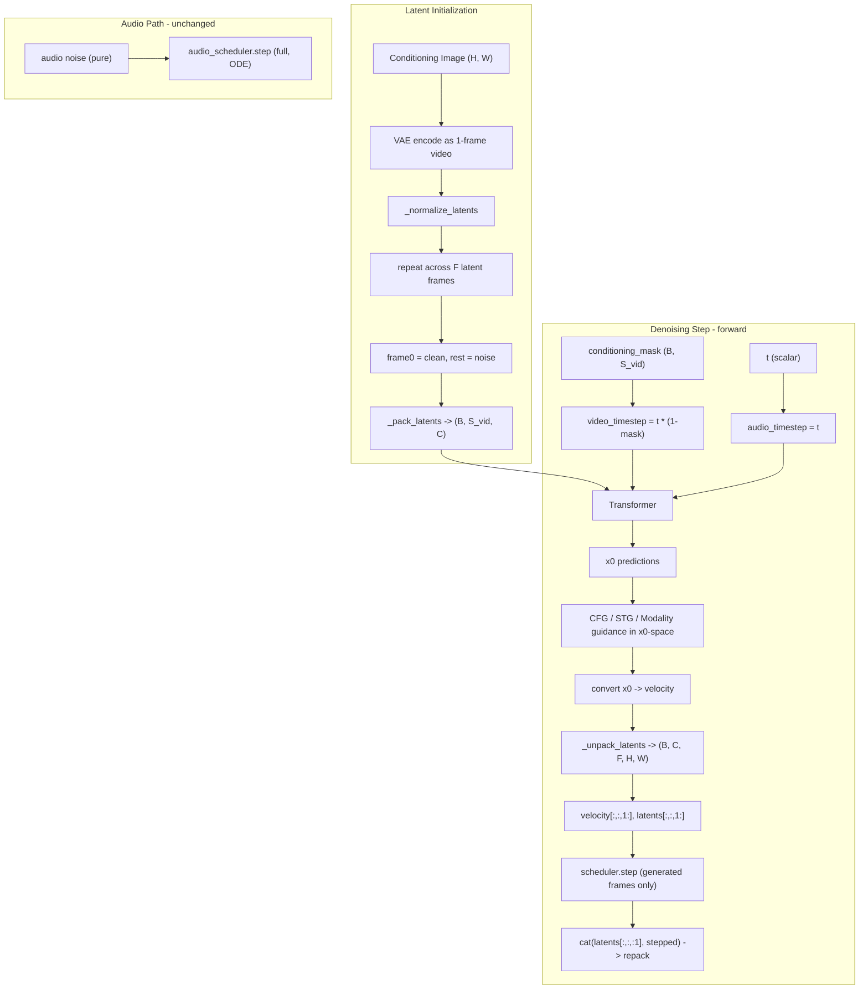

# Step 12 -- LTX2 I2AV Adapter (Image-to-Audio-Video)

## Mechanism (from `pipeline_ltx2_image2video.py`)

Image conditioning works through three reinforcing layers:

1. **Latent initialization**: VAE-encode image as 1-frame video, repeat across time, mask-blend with noise (`frame0 = clean, rest = noise`)
2. **Timestep masking**: `video_timestep = t * (1 - conditioning_mask)` -- conditioned tokens see timestep 0 in the transformer
3. **First-frame preservation**: scheduler step runs only on frames `1:`, frame 0 is preserved exactly each step

Audio is NOT conditioned by the image -- full noise init, scalar timestep, normal scheduling.



## Design: Inherit from `BaseAdapter` (flat hierarchy)

Create `LTX2_I2AV_Adapter(BaseAdapter)` as an independent adapter. Per constraint
#12a, all model adapters MUST inherit directly from `BaseAdapter` — never from
another adapter. Shared logic with `LTX2_T2AV_Adapter` (encode_prompt,
decode_latents, RoPE setup, guidance computation) should be extracted into private
helper functions in a shared module (e.g., `ltx2/_common.py`) or duplicated where
the overlap is small.

---

## Files to Create / Modify

### 1. NEW: `src/flow_factory/models/ltx2/ltx2_i2av.py`

**Sample dataclass**: `LTX2I2AVSample(LTX2Sample)` adds `condition_images` and `conditioning_mask`:

```python
@dataclass
class LTX2I2AVSample(LTX2Sample):
    _id_fields = LTX2Sample._id_fields | frozenset({'condition_images'})
    condition_images: Optional[ImageBatch] = None
    conditioning_mask: Optional[torch.Tensor] = None

    def __post_init__(self):
        super().__post_init__()
        if self.condition_images is not None:
            self.condition_images = standardize_image_batch(self.condition_images, 'pt')
            if isinstance(self.condition_images, torch.Tensor):
                self.condition_images = list(self.condition_images.unbind(0))
```

**Adapter class**: `LTX2_I2AV_Adapter(BaseAdapter)`

Implements all 7 abstract methods. Shared logic with T2AV (encode_prompt,
decode_latents, audio scheduler creation, RoPE coord computation) should be
extracted into `ltx2/_common.py` helper functions.

Key methods with I2AV-specific behavior:

- **`load_pipeline()`** -- Load `LTX2ImageToVideoPipeline` instead of `LTX2Pipeline`. Same pretrained weights, different pipeline class (provides `prepare_latents(image=...)`)

- **`encode_image(images, device)`** -- Preprocess images via `pipeline.video_processor.preprocess(images)` to match expected input format. Return `{'condition_images': preprocessed_tensor}`. (VAE encoding deferred to `prepare_latents` in `inference()`)

- **`forward(..., conditioning_mask=None)`** -- Three key differences vs T2AV:
  - Build `video_timestep = ts.unsqueeze(-1) * (1 - conditioning_mask)` (per-token) and pass `audio_timestep=ts` (scalar) to transformer
  - After x0 guidance and velocity conversion: **unpack** video tensors to `(B, C, F, H, W)`, run `scheduler.step` on **frames 1: only**, cat frame 0 back, repack
  - Pass `conditioning_mask` doubled for CFG batch dimension

- **`inference(..., condition_images=None)`** -- Two key differences vs T2AV:
  - Call `self.pipeline.prepare_latents(image=condition_images, ...)` which returns `(video_latents, conditioning_mask)` instead of just `video_latents`
  - Pass `conditioning_mask` to every `self.forward(...)` call in the loop

### 2. MODIFY: `src/flow_factory/models/registry.py`

Add registry entry:

```python
'ltx2_i2av': 'flow_factory.models.ltx2.ltx2_i2av.LTX2_I2AV_Adapter',
```

### 3. NEW: `examples/grpo/lora/ltx2_i2av.yaml`

Derived from `ltx2_t2av.yaml` with changes:
- `model_type: "ltx2_i2av"`
- `data.image_dir` pointing to conditioning images
- Dataset must include an `image` column mapping prompts to conditioning image filenames

### 4. MODIFY: `.docs/ltx2-research/COMMIT_PLAN.md`

Add Step 12 describing I2AV support.

---

## Key `forward()` Diff (vs T2AV parent)

The critical change is in the transformer call and scheduler step. In T2AV `forward()`, the transformer receives a scalar `timestep=ts`. In I2AV:

```python
# Build per-token video timestep (conditioned tokens see t=0)
if conditioning_mask is not None:
    # conditioning_mask: (B, S_vid), values 1.0 for conditioned, 0.0 for generated
    cm = conditioning_mask
    if do_cfg:
        cm = torch.cat([cm, cm])  # double for CFG batch
    video_ts = ts.unsqueeze(-1) * (1 - cm)  # (2B, S_vid) or (B, S_vid)
else:
    video_ts = ts

# Transformer call:
self.transformer(
    ...
    timestep=video_ts,       # per-token for video (CHANGED)
    audio_timestep=ts,       # scalar for audio (NEW kwarg)
    sigma=ts,
    ...
)
```

For the scheduler step, after computing `video_pred` velocity:

```python
if conditioning_mask is not None:
    # Unpack to 5D for frame-level slicing
    video_pred_5d = self.pipeline._unpack_latents(
        video_pred, latent_f, latent_h, latent_w,
        self.pipeline.transformer_spatial_patch_size,
        self.pipeline.transformer_temporal_patch_size,
    )
    video_latents_5d = self.pipeline._unpack_latents(
        video_latents, latent_f, latent_h, latent_w, ...
    )

    # Step only generated frames (1:), preserve frame 0
    gen_pred = video_pred_5d[:, :, 1:].flatten(...)   # reshape for scheduler
    gen_lats = video_latents_5d[:, :, 1:].flatten(...)
    video_output = self.scheduler.step(gen_pred, t, gen_lats, t_next, ...)

    # Reassemble: frame 0 (clean) + stepped frames
    next_5d = torch.cat([video_latents_5d[:, :, :1], output_5d], dim=2)
    next_packed = self.pipeline._pack_latents(next_5d, ...)
    video_output.next_latents = next_packed
else:
    # Fallback to parent behavior (full-sequence step)
    video_output = self.scheduler.step(video_pred, t, video_latents, t_next, ...)
```

## Key `inference()` Diff (vs T2AV parent)

```python
# Image-conditioned latent preparation (returns mask)
video_latents, conditioning_mask = self.pipeline.prepare_latents(
    image=condition_images,   # preprocessed image tensor
    batch_size=batch_size,
    num_channels_latents=...,
    height=height, width=width, num_frames=num_frames,
    noise_scale=noise_scale,
    dtype=torch.float32, device=device, generator=generator,
)
# Audio: same as T2AV (pure noise, no image conditioning)
audio_latents = self.pipeline.prepare_audio_latents(...)

# Denoising loop: pass conditioning_mask to forward()
for i, t in enumerate(timesteps):
    output = self.forward(..., conditioning_mask=conditioning_mask)
    ...
```

## Constraints

- `LTX2ImageToVideoPipeline` is available at `diffusers.pipelines.ltx2.pipeline_ltx2_image2video` in the local diffusers checkout
- Transformer already accepts `audio_timestep` kwarg (confirmed in I2V pipeline usage)
- `_pack_latents` / `_unpack_latents` are pipeline methods, accessed via `self.pipeline`
- Log probabilities: computed only for generated frames (1:), which correctly excludes the conditioned first frame from the RL policy gradient
- No changes to reward models, trainer, or base infrastructure needed

## Implementation Todos

1. Extract shared T2AV/I2AV helpers (encode_prompt, decode_latents, audio scheduler, RoPE, guidance logic) into `ltx2/_common.py`
2. Refactor `LTX2_T2AV_Adapter` to use the extracted helpers (verify no behavioral change)
3. Create `LTX2I2AVSample` dataclass in `ltx2_i2av.py` with `condition_images` and `conditioning_mask` fields
4. Create `LTX2_I2AV_Adapter(BaseAdapter)` using shared helpers + I2AV-specific `load_pipeline`, `encode_image`, `forward`, `inference`
5. Register `ltx2_i2av` in `registry.py` and create `examples/grpo/lora/ltx2_i2av.yaml`
6. Update `COMMIT_PLAN.md` with Step 12
