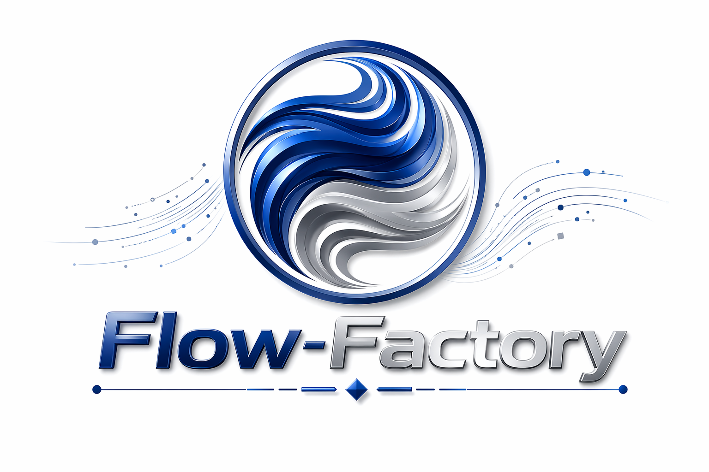

<p align="center">
  
</p>
<h1 align="center">Flow-Factory</h1>

<!-- <p align="center">
  
</p>

<h1 align="center"> Flow-Factory </h1> -->

<p align="center">
  <b>Easy Reinforcement Learning for Diffusion and Flow-Matching Models</b>
</p>

# 🔥 News

* **[2026-02-01]** Support for multiple **Attention Backends**! You can now optimize memory and speed by setting the `attn_backend` parameter in your config:
```yaml
  model:
      attn_backend: "flash" # Options: "native", "xformers", "flash_hub", "_flash_3_hub", "_flash_3_varlen_hub"
```
This experimental feature leverages `diffusers`'s `transformer.set_attention_backend`. Check the [official diffusers documentation](https://huggingface.co/docs/diffusers/main/en/optimization/attention_backends#available-backends) for all available options.
> We recommend installing the `kernels` package (`pip install kernels`) and using `flash_hub`, `flash_varlen_hub`, `_flash_3_hub`, or `_flash_3_varlen_hub` to avoid the complexity and potential incompatibility of installing Flash-Attention directly.

* **[2026-01-17]** We have added the latest FLUX2-Klein series! Follow the commands to start:
```bash
# Clone the repo with submodule `diffusers`
git clone --recursive https://github.com/X-GenGroup/Flow-Factory.git
cd Flow-Factory
# Fetch the source code of `diffusers==0.37.0.dev`
git submodule update --init --recursive
# Install `diffusers==0.37.0.dev`
cd diffusers
pip install -e .
# Install Flow-Factory
cd ..
pip install -e .
```

# 📕 Table of Contents

- [Supported Models](#-supported-models)
- [Supported Algorithms](#-supported-algorithms)
- [Get Started](#-get-started)
  - [Installation](#installation)
  - [Experiment Trackers](#experiment-trackers)
  - [Quick Start Example](#quick-start-example)
- [Dataset](#-dataset)
  - [Text-to-Image & Text-to-Video](#text-to-image--text-to-video)
  - [Image-to-Image & Image-to-Video](#image-to-image--image-to-video)
  - [Video-to-Video](#video-to-video)
- [Reward Model](#-reward-model)
- [Acknowledgements](#-acknowledgements)

# 🤗 Supported Models

<table>
  <tr><th>Task</th><th>Model</th><th>Model Size</th><th>Model Type</th></tr>
  <tr><td rowspan="4">Text-to-Image</td><td><a href="https://huggingface.co/black-forest-labs/FLUX.1-dev">FLUX.1-dev</a></td><td>13B</td><td>flux1</td></tr>
  <tr><td><a href="https://huggingface.co/Tongyi-MAI/Z-Image-Turbo">Z-Image-Turbo</a></td><td>12B</td><td>z-image</td></tr>
  <tr><td><a href="https://huggingface.co/Qwen/Qwen-Image">Qwen-Image</a></td><td>20B</td><td>qwen-image</td></tr>
  <tr><td><a href="https://huggingface.co/Qwen/Qwen-Image-2512">Qwen-Image-2512</a></td><td>20B</td><td>qwen-image</td></tr>

  <tr><td>Image-to-Image</td><td><a href="https://huggingface.co/black-forest-labs/FLUX.1-Kontext-dev">FLUX.1-Kontext-dev</a></td><td>13B</td><td>flux1-kontext</td></tr>
  
  <tr><td rowspan="2">Image(s)-to-Image</td><td><a href="https://huggingface.co/Qwen/Qwen-Image-Edit-2509">Qwen-Image-Edit-2509</a></td><td>20B</td><td>qwen-image-edit-plus</td></tr>
  <tr><td><a href="https://huggingface.co/Qwen/Qwen-Image-Edit-2511">Qwen-Image-Edit-2511</a></td><td>20B</td><td>qwen-image-edit-plus</td></tr>

  <tr><td rowspan="5">Text-to-Image & Image(s)-to-Image</td><td><a href="https://huggingface.co/black-forest-labs/FLUX.2-dev">FLUX.2-dev</a></td><td>30B</td><td>flux2</td></tr>
  <tr><td><a href="https://huggingface.co/black-forest-labs/FLUX.2-klein-4B">FLUX.2-klein-4B</a></td><td>4B</td><td>flux2-klein</td></tr>
  <tr><td><a href="https://huggingface.co/black-forest-labs/FLUX.2-klein-9B">FLUX.2-klein-9B</a></td><td>9B</td><td>flux2-klein</td></tr>
  <tr><td><a href="https://huggingface.co/black-forest-labs/FLUX.2-klein-base-4B">FLUX.2-klein-base-4B</a></td><td>4B</td><td>flux2-klein</td></tr>
  <tr><td><a href="https://huggingface.co/black-forest-labs/FLUX.2-klein-base-9B">FLUX.2-klein-base-9B</a></td><td>9B</td><td>flux2-klein</td></tr>

  <tr><td rowspan="4">Text-to-Video</td><td><a href="https://huggingface.co/Wan-AI/Wan2.1-T2V-1.3B-Diffusers">Wan2.1-T2V-1.3B</a></td><td>1.3B</td><td>wan2_t2v</td></tr>
  <tr><td><a href="https://huggingface.co/Wan-AI/Wan2.1-T2V-14B-Diffusers">Wan2.1-T2V-14B</a></td><td>14B</td><td>wan2_t2v</td></tr>
  <tr><td><a href="https://huggingface.co/Wan-AI/Wan2.2-TI2V-5B-Diffusers">Wan2.2-TI2V-5B</a></td><td>5B</td><td>wan2_t2v</td></tr>
  <tr><td><a href="https://huggingface.co/Wan-AI/Wan2.2-T2V-A14B-Diffusers">Wan2.2-T2V-A14B</a></td><td>A14B</td><td>wan2_t2v</td></tr>

  <tr><td rowspan="5">Image-to-Video</td><td><a href="https://huggingface.co/Wan-AI/Wan2.1-I2V-14B-480P-Diffusers">Wan2.1-I2V-14B-480P</a></td><td>14B</td><td>wan2_i2v</td></tr>
  <tr><td><a href="https://huggingface.co/Wan-AI/Wan2.1-I2V-14B-480P-Diffusers">Wan2.1-I2V-14B-480P</a></td><td>14B</td><td>wan2_i2v</td></tr>
  <tr><td><a href="https://huggingface.co/Wan-AI/Wan2.1-I2V-14B-720P-Diffusers">Wan2.1-I2V-14B-720P</a></td><td>14B</td><td>wan2_i2v</td></tr>
  <tr><td><a href="https://huggingface.co/Wan-AI/Wan2.2-TI2V-5B-Diffusers">Wan2.2-TI2V-5B</a></td><td>5B</td><td>wan2_i2v</td></tr>
  <tr><td><a href="https://huggingface.co/Wan-AI/Wan2.2-I2V-A14B-Diffusers">Wan2.2-I2V-A14B</a></td><td>A14B</td><td>wan2_i2v</td></tr>
</table>

# 💻 Supported Algorithms

| Algorithm      | `trainer_type` |
|----------------|----------------|
| GRPO           | grpo           |
| GRPO-Guard     | grpo-guard     |
| DiffusionNFT   | nft            |
| AWM            | awm            |

See [`Algorithm Guidance`](guidance/algorithms.md) for more information.

> Model and algorithm are fully decoupled in Flow-Factory, enabling all listed model–algorithm combinations to work out of the box. The configurations under `examples/` have been verified to yield measurable performance gains. For unlisted combinations, find the closest (task, algorithm) config and swap in the desired model or algorithm parameters.

# 💾 Hardward Requirements

# 🚀 Get Started

## Installation

```bash
git clone https://github.com/Jayce-Ping/Flow-Factory.git
cd Flow-Factory
pip install -e .
```

Optional dependencies, such as `deepspeed`, are also available. Install them with:

```bash
pip install -e .[deepspeed]
```

## Experiment Trackers

To use [Weights & Biases](https://wandb.ai/site/) or [SwanLab](https://github.com/SwanHubX/SwanLab) to log experimental results, install extra dependencies via `pip install -e .[wandb]` or `pip install -e .[swanlab]`.

After installation, set corresponding arguments in the config file:

```yaml
run_name: null  # Run name (auto: {model_type}_{finetune_type}_{trainer_type}_{timestamp})
project: "Flow-Factory"  # Project name for logging
logging_backend: "wandb"  # Options: wandb, swanlab, tensorboard, none
```

These trackers allow you to visualize both **training samples** and **metric curves** online:


## Quick Start Example

Start training with the following simple command:

```bash
ff-train examples/grpo/lora/flux1.yaml
```


# 📊 Dataset

The unified structure of dataset is:

```plaintext
|---- dataset
|----|--- train.txt / train.jsonl
|----|--- test.txt / test.jsonl (optional)
|----|--- images (optional)
|----|---| image1.png
|----|---| ...
|----|--- videos (optional)
|----|---| video1.mp4
|----|---| ...
```

## Text-to-Image & Text-to-Video

For text-to-image and text-to-video tasks, the only required input is the **prompt** in plain text format. Use `train.txt` and `test.txt` (optional) with following format:

```
A hill in a sunset.
An astronaut riding a horse on Mars.
```
> Example: [dataset/pickscore](./dataset/pickscore/train.txt)

Each line represents a single text prompt. Alternatively, you can use `train.jsonl` and `test.jsonl` in the following format:

```jsonl
{"prompt": "A hill in a sunset."}
{"prompt": "An astronaut riding a horse on Mars."}
```

> Example: [dataset/t2is](./dataset/t2is/train.jsonl)

`negative_prompt` is also supported:

```jsonl
{"prompt": "A hill in a sunset.", "negative_prompt": "low quality, blurry, distorted, poorly drawn"}
{"prompt": "An astronaut riding a horse on Mars.", "negative_prompt": "low quality, blurry, distorted, poorly drawn"}
```

> Example: [dataset/t2is_neg](./dataset/t2is_neg/train.jsonl)

## Image-to-Image & Image-to-Video

For tasks involving conditioning images, use `train.jsonl` and `test.jsonl` in the following format:

```jsonl
{"prompt": "A hill in a sunset.", "image": "path/to/image1.png"}
{"prompt": "An astronaut riding a horse on Mars.", "image": "path/to/image2/png"}
```

> Example: [dataset/sharegpt4o_image_mini](./dataset/sharegpt4o_image_mini/train.jsonl)

The default root directory for images is `dataset_dir/images`, and for videos, it is `dataset_dir/videos`. You can override these locations by setting the `image_dir` and `video_dir` variables in the config file:

```yaml
data:
    dataset_dir: "path/to/dataset"
    image_dir: "path/to/image_dir" # (default to "{dataset_dir}/images")
    video_dir: "path/to/video_dir" # (default to "{dataset_dir}/videos")
```

For models like [FLUX.2-dev]((https://huggingface.co/black-forest-labs/FLUX.2-dev)) and [Qwen-Image-Edit-2511]((https://huggingface.co/Qwen/Qwen-Image-Edit-2511)) that are able to accept multiple images as conditions, use the `images` key with a list of image paths:

```jsonl
{"prompt": "A hill in a sunset.", "images": ["path/to/condition_image_1_1.png", "path/to/condition_image_1_2.png"]}
{"prompt": "An astronaut riding a horse on Mars.", "images": ["path/to/condition_image_2_1.png", "path/to/condition_image_2_2.png"]}
```

## Video-to-Video

```jsonl
{"prompt": "A hill in a sunset.", "video": "path/to/video1.mp4"}
{"prompt": "An astronaut riding a horse on Mars.", "videos": ["path/to/video2.mp4", "path/to/video3.mp4"]}
```

# 💯 Reward Model

Flow-Factory provides a flexible reward model system that supports both built-in and custom reward models for reinforcement learning.

## Reward Model Types

Flow-Factory supports two types of reward models:

- **Pointwise Reward**: Computes independent scores for each sample (e.g., aesthetic quality, text-image alignment).
- **Pairwise Reward**: Computes rewards based on the pairwise comparison within the group. This is a special case of the following **Groupwise Reward**.
- **Groupwise Reward**: Computes rewards that requires the all samples in a group (e.g., ranking-based score or pairwise comparison).

## Built-in Reward Models

The following reward models are pre-registered and ready to use:

| Name | Type | Description | Reference |
|------|------|-------------|-----------|
| `PickScore` | Pointwise | CLIP-based aesthetic scoring model | [PickScore](https://huggingface.co/yuvalkirstain/PickScore_v1) |
| `PickScore_Rank` | Groupwise | Ranking-based reward using PickScore | [PickScore](https://huggingface.co/yuvalkirstain/PickScore_v1) |
| `CLIP` | Pointwise | Image-text cosine similarity | [CLIP](https://huggingface.co/openai/clip-vit-large-patch14) |

## Using Built-in Reward Models

Simply specify the reward model name in your config file:
```yaml
rewards:
  name: "aesthetic" # Alias for this reward model
  reward_model: "PickScore" # Reward model type or a path like 'my_package.rewards.CustomReward'
  batch_size: 16
  device: "cuda"
  dtype: bfloat16
```

Refer to [Rewards Guidance](guidance/rewards.md) for more information about advanced usage, such as creating a custom reward model.


# 🤗 Acknowledgements

This repository is based on [diffusers](https://github.com/huggingface/diffusers/), [accelerate](https://github.com/huggingface/accelerate) and [peft](https://github.com/huggingface/peft).
We thank them for their contributions to the community!!!

# 📝 Citation

If you find Flow-Factory useful in your research, please consider citing our paper:

```bibtex
@article{ping2026flowfactory,
  title={Flow-Factory: A Unified Framework for Reinforcement Learning in Flow-Matching Models}, 
  author={Bowen Ping and Chengyou Jia and Minnan Luo and Hangwei Qian and Ivor Tsang},
  journal={arXiv preprint arXiv:2602.12529},
  year={2026},
  url={https://arxiv.org/abs/2602.12529}, 
}
```