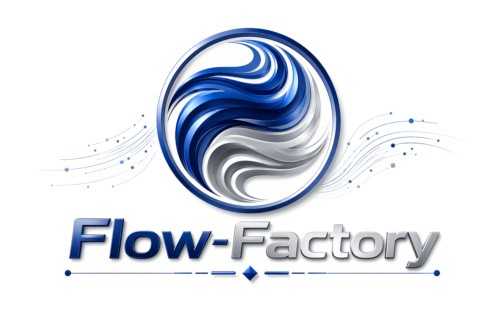

<p align="center">
  
</p>
<h1 align="center">Flow-Factory</h1>

<p align="center">
  <b>Unified Online RL and Offline Fine-Tuning for Diffusion and Flow-Matching Models</b>
</p>

# 🔥 News

* **[2026-09-20]** **Qwen-Image 2.1** support! Train the unified text-to-image and
  ordered multi-image editing model with the [GRPO + LoRA recipe](examples/grpo/lora/qwen_image_2_1/default.yaml).
  Until Qwen-Image 2.1 reaches a released Diffusers package, install the pinned submodule:
```bash
git submodule update --init
pip install -e ./diffusers
pip install -e .
```

* **[2026-08-21]** **MiniMax H3 Audio-Video** support! Fine-tune
  [text-to-audio-video](examples/grpo/lora/minimax_h3_t2va/debug.yaml),
  [first/last-frame-to-audio-video](examples/grpo/lora/minimax_h3_fl2va/default.yaml), and
  [ordered-reference-to-audio-video](examples/grpo/lora/minimax_h3_ref2va/default.yaml)
  workflows with GRPO + LoRA. H3 requires diffusers 0.40.0 or newer:
```bash
pip install 'diffusers>=0.40.0'
pip install -e .
```

* **[2026-04-25]** **LTX-2 Audio-Video** support! Generate synchronized audio-video content with RL fine-tuning through the released Diffusers API:
```bash
pip install 'diffusers>=0.40.0'
```

* **[2026-02-01]** Support for multiple **Attention Backends**! Attention-backend selection now lives in the unified `acceleration:` block (the old `model.attn_backend` knob was removed), where it can be combined with `torch.compile` and feature caching — applied in list order:
```yaml
  acceleration:
    shared:
      - name: attention_backend
        params: { backend: "flash" } # Options: "native", "xformers", "flash_hub", "_flash_3_hub", "_flash_3_varlen_hub"
```
This experimental feature leverages `diffusers`'s `transformer.set_attention_backend`. Check the [official diffusers documentation](https://huggingface.co/docs/diffusers/main/en/optimization/attention_backends#available-backends) for all available options. See [`guidance/acceleration.md`](guidance/acceleration.md) for the full acceleration layer.
> We recommend installing the `kernels` package (`pip install kernels`) and using `flash_hub`, `flash_varlen_hub`, `_flash_3_hub`, or `_flash_3_varlen_hub` to avoid the complexity and potential incompatibility of installing Flash-Attention directly.

# 📕 Table of Contents

- [Supported Models](#-supported-models)
- [Supported Algorithms](#-supported-algorithms)
- [Get Started](#-get-started)
  - [Installation](#installation)
  - [Experiment Trackers](#experiment-trackers)
  - [Quick Start Example](#quick-start-example)
- [Guidance](#-guidance)
- [Dataset](#-dataset)
  - [Offline SFT and Preference Data](#offline-sft-and-preference-data)
  - [Text-to-Image & Text-to-Video](#text-to-image--text-to-video)
  - [Image-to-Image & Image-to-Video](#image-to-image--image-to-video)
- [Reward Model](#-reward-model)
- [Acknowledgements](#-acknowledgements)

# 🤗 Supported Models

<table>
  <tr><th>Task</th><th>Model</th><th>Model Size</th><th>Model Type</th></tr>
  <tr><td rowspan="6">Text-to-Image</td><td><a href="https://huggingface.co/collections/stabilityai/stable-diffusion-35">stable-diffusion-3.5-medium/large</a></td><td>2.5B/8.1B</td><td>sd3-5</td></tr>
  <tr><td><a href="https://huggingface.co/black-forest-labs/FLUX.1-dev">FLUX.1-dev</a></td><td>13B</td><td>flux1</td></tr>
  <tr><td><a href="https://huggingface.co/Tongyi-MAI/Z-Image-Turbo">Z-Image-Turbo</a></td><td>6B</td><td>z-image</td></tr>
  <tr><td><a href="https://huggingface.co/Tongyi-MAI/Z-Image">Z-Image</a></td><td>6B</td><td>z-image</td></tr>
  <tr><td><a href="https://huggingface.co/Qwen/Qwen-Image">Qwen-Image</a></td><td>20B</td><td>qwen-image</td></tr>
  <tr><td><a href="https://huggingface.co/Qwen/Qwen-Image-2512">Qwen-Image-2512</a></td><td>20B</td><td>qwen-image</td></tr>
  <tr><td>Image-to-Image</td><td><a href="https://huggingface.co/black-forest-labs/FLUX.1-Kontext-dev">FLUX.1-Kontext-dev</a></td><td>13B</td><td>flux1-kontext</td></tr>
  
  <tr><td rowspan="2">Image(s)-to-Image</td><td><a href="https://huggingface.co/Qwen/Qwen-Image-Edit-2509">Qwen-Image-Edit-2509</a></td><td>20B</td><td>qwen-image-edit-plus</td></tr>
  <tr><td><a href="https://huggingface.co/Qwen/Qwen-Image-Edit-2511">Qwen-Image-Edit-2511</a></td><td>20B</td><td>qwen-image-edit-plus</td></tr>

  <tr><td rowspan="9">Text-to-Image & Image(s)-to-Image</td><td><a href="https://huggingface.co/black-forest-labs/FLUX.2-dev">FLUX.2-dev</a></td><td>32B</td><td>flux2</td></tr>
  <tr><td><a href="https://huggingface.co/black-forest-labs/FLUX.2-klein-4B">FLUX.2-klein-4B</a></td><td>4B</td><td>flux2-klein</td></tr>
  <tr><td><a href="https://huggingface.co/black-forest-labs/FLUX.2-klein-9B">FLUX.2-klein-9B</a></td><td>9B</td><td>flux2-klein</td></tr>
  <tr><td><a href="https://huggingface.co/black-forest-labs/FLUX.2-klein-base-4B">FLUX.2-klein-base-4B</a></td><td>4B</td><td>flux2-klein</td></tr>
  <tr><td><a href="https://huggingface.co/black-forest-labs/FLUX.2-klein-base-9B">FLUX.2-klein-base-9B</a></td><td>9B</td><td>flux2-klein</td></tr>
  <tr><td><a href="https://huggingface.co/ByteDance-Seed/BAGEL-7B-MoT">BAGEL-7B-MoT</a></td><td>14B</td><td>bagel</td></tr>
  <tr><td><a href="https://huggingface.co/sensenova/SenseNova-U1-8B-MoT">SenseNova-U1 1.0</a></td><td>16B</td><td>sensenova</td></tr>
  <tr><td><a href="https://huggingface.co/sensenova/SenseNova-U1.5-8B-MoT">SenseNova-U1 1.5</a></td><td>16B</td><td>sensenova</td></tr>
  <tr><td><a href="https://huggingface.co/Qwen/Qwen-Image-2.1">Qwen-Image 2.1</a></td><td>7B</td><td>qwen-image-2.1</td></tr>

  <tr><td rowspan="4">Text-to-Video</td><td><a href="https://huggingface.co/Wan-AI/Wan2.1-T2V-1.3B-Diffusers">Wan2.1-T2V-1.3B</a></td><td>1.3B</td><td>wan2_t2v</td></tr>
  <tr><td><a href="https://huggingface.co/Wan-AI/Wan2.1-T2V-14B-Diffusers">Wan2.1-T2V-14B</a></td><td>14B</td><td>wan2_t2v</td></tr>
  <tr><td><a href="https://huggingface.co/Wan-AI/Wan2.2-TI2V-5B-Diffusers">Wan2.2-TI2V-5B</a></td><td>5B</td><td>wan2_t2v</td></tr>
  <tr><td><a href="https://huggingface.co/Wan-AI/Wan2.2-T2V-A14B-Diffusers">Wan2.2-T2V-A14B</a></td><td>A14B</td><td>wan2_t2v</td></tr>

  <tr><td rowspan="4">Image-to-Video</td><td><a href="https://huggingface.co/Wan-AI/Wan2.1-I2V-14B-480P-Diffusers">Wan2.1-I2V-14B-480P</a></td><td>14B</td><td>wan2_i2v</td></tr>
  <tr><td><a href="https://huggingface.co/Wan-AI/Wan2.1-I2V-14B-720P-Diffusers">Wan2.1-I2V-14B-720P</a></td><td>14B</td><td>wan2_i2v</td></tr>
  <tr><td><a href="https://huggingface.co/Wan-AI/Wan2.2-TI2V-5B-Diffusers">Wan2.2-TI2V-5B</a></td><td>5B</td><td>wan2_i2v</td></tr>
  <tr><td><a href="https://huggingface.co/Wan-AI/Wan2.2-I2V-A14B-Diffusers">Wan2.2-I2V-A14B</a></td><td>A14B</td><td>wan2_i2v</td></tr>
  <tr><td>First/Last-Frame-to-Video</td><td><a href="https://huggingface.co/Wan-AI/Wan2.1-FLF2V-14B-720P-diffusers">Wan2.1-FLF2V-14B-720P</a></td><td>14B</td><td>wan2_i2v</td></tr>

  <tr><td rowspan="2">Text-to-Audio-Video</td><td><a href="https://huggingface.co/Lightricks/LTX-2">LTX-2</a></td><td>19B</td><td>ltx2_t2av</td></tr>
  <tr><td><a href="https://huggingface.co/dg845/LTX-2.3-Diffusers">LTX-2.3 (Diffusers)</a></td><td>22B</td><td>ltx2_t2av</td></tr>
  <tr><td rowspan="2">Image-to-Audio-Video</td><td><a href="https://huggingface.co/Lightricks/LTX-2">LTX-2</a></td><td>19B</td><td>ltx2_i2av</td></tr>
  <tr><td><a href="https://huggingface.co/dg845/LTX-2.3-Diffusers">LTX-2.3 (Diffusers)</a></td><td>22B</td><td>ltx2_i2av</td></tr>
  <tr><td>Text-to-Audio-Video</td><td><a href="https://huggingface.co/MiniMaxAI/MiniMax-H3">MiniMax H3 T2VA</a></td><td>33B</td><td>minimax-h3-t2va</td></tr>
  <tr><td>First/Last-Frame-to-Audio-Video</td><td><a href="https://huggingface.co/MiniMaxAI/MiniMax-H3">MiniMax H3 FL2VA</a></td><td>33B</td><td>minimax-h3-fl2va</td></tr>
  <tr><td>Ordered-Reference-to-Audio-Video</td><td><a href="https://huggingface.co/MiniMaxAI/MiniMax-H3">MiniMax H3 Ref2VA</a></td><td>33B</td><td>minimax-h3-ref2va</td></tr>
</table>

> To support new models, see [Guidance/New Model](guidance/new_model.md).

> **Offline output support:** SFT and offline DPO currently support `sd3-5`, `flux1`,
> `flux1-kontext`, `flux2`, `flux2-klein`, `qwen-image`, `qwen-image-edit-plus`,
> `qwen-image-2.1`, `z-image`,
> `bagel`, `sensenova`, `wan2_t2v`, `wan2_i2v`, `ltx2_t2av`, `ltx2_i2av`, and all
> MiniMax H3 workflows. Video/audio targets are encoded on demand and are never written to
> the preprocessing cache. Conditioned adapters prepare one immutable condition state per batch;
> offline DPO shares that exact realization across chosen and rejected arms. See the
> [offline model matrix](guidance/datasets.md#offline-model-support).

> **MiniMax H3 status:** T2VA, FL2VA, and Ref2VA completed all 36 real-weight smoke cells in
> the documented matrix: three workflows x DDP/DeepSpeed ZeRO-2/FSDP2 x
> GRPO/SFT/offline DPO/TDM. The FL2VA first-plus-last SFT/offline-DPO gate also passed.
> The T2VA [native-quality FSDP2](examples/grpo/lora/minimax_h3_t2va/quality_720p_fsdp2.yaml)
> path has separate initialization, checkpoint, decode, and evaluation coverage. These results
> do not claim a completed long-run reward trend, convergence, or numerical parity.
> H3 requires B=1, has no CFG, uses neutral guidance `1.0`, and
> keeps separate video/audio trajectories.
> Video uses shift 12, audio uses shift 3, and the model predicts data-ward velocity.
> `num_inference_steps=N` means N transitions and N + 1 states.

# 💻 Supported Algorithms

| Algorithm      | `trainer_type` | Reference / objective |
|----------------|----------------|-------|
| SFT            | sft            | Supervised flow matching over V2 demonstrations |
| Offline DPO    | offline-dpo    | [Diffusion-DPO](https://arxiv.org/abs/2311.12908) over V2 preference pairs |
| Online DPO     | dpo            | [Diffusion-DPO](https://arxiv.org/abs/2311.12908) with generated, reward-ranked pairs |
| GRPO           | grpo           | [Flow-GRPO](https://arxiv.org/abs/2505.05470) / [Dance-GRPO](https://arxiv.org/abs/2505.07818) |
| DiffusionNFT   | nft            | [DiffusionNFT](https://arxiv.org/abs/2509.16117) |
| AWM            | awm            | [Advantage Weighted Matching](https://arxiv.org/abs/2509.25050) |
| DGPO           | dgpo           | [DGPO](https://arxiv.org/abs/2510.08425) |
| GRPO-Guard     | grpo-guard     | [GRPO-Guard](https://arxiv.org/abs/2510.22319) |
| DPPO           | dppo           | [Flow-DPPO](https://arxiv.org/abs/2606.11025) |
| CRD            | crd            | [Centered Reward Distillation](https://arxiv.org/abs/2603.14128) ([Blog (Chinese)](https://mp.weixin.qq.com/s/fpTi7PPi3APSNJQ2kXN3Dw))|
| DiffusionOPD   | diffusion-opd  | [DiffusionOPD](https://arxiv.org/abs/2605.15055) |
| DMD2           | dmd2           | [DMD2](https://arxiv.org/abs/2405.14867) |
| TDM            | tdm            | [Trajectory Distribution Matching](https://arxiv.org/abs/2503.06674) |
| TDM-R1         | tdm-r1         | [TDM-R1](https://arxiv.org/abs/2603.07700) |

See [`Algorithm Guidance`](guidance/algorithms.md) for more information.

> Models and algorithms are decoupled at the framework interface. The documented ten-mode
> real-weight smoke matrix completed all 120 model/backend/algorithm cells. Combinations outside
> that matrix still require separate execution evidence, and smoke completion is not a claim of
> reward improvement.

# 💾 Hardware Requirements

# 🚀 Get Started

## Installation

```bash
git clone https://github.com/X-GenGroup/Flow-Factory.git
cd Flow-Factory
pip install -e .
```

Flow-Factory requires Python 3.10 or newer and PyTorch 2.10 or newer. PyTorch 2.10 includes the
native `torch.optim.Muon` API used by Muon optimizer configs.

Optional dependencies, such as `deepspeed`, are also available. Install them with:

```bash
pip install -e .[deepspeed]
```

> **Note**: The Bagel adapter requires `flash-attn` (>= 2.5.8) and `opencv-python`. Install them with `pip install -e .[bagel]` (the `[bagel]` extra is intentionally not part of `[all]` because flash-attn is heavy to build).

> **Dependency:** MiniMax H3 and LTX2 require the released `diffusers>=0.40.0` API.
> Qwen-Image 2.1 currently requires the bundled `diffusers` submodule; run
> `git submodule update --init && pip install -e ./diffusers` before installing Flow-Factory.
> Its initial adapter deliberately uses batch size 1 and disables the model's prefix KV cache so
> online rollout and gradient replay follow the same numerical path.
> PyAV >=17.0.0 decodes ordered video/audio references and target media.
> TorchAudio 2.10 delegates audio loading and saving to TorchCodec, which also requires FFmpeg
> shared libraries. The CUDA image installs those system libraries automatically.

A CUDA training image (Python 3.12, **uv**-based install, PyTorch 2.10 + `cu129`, `deepspeed`, `wandb`, released `diffusers`) is defined under [`docker/docker-cuda/`](docker/docker-cuda/Dockerfile). See [`docker/README.md`](docker/README.md) for build and run instructions (including `linux/amd64` on Apple Silicon).

## Experiment Trackers

To use [Weights & Biases](https://wandb.ai/site/) or [SwanLab](https://github.com/SwanHubX/SwanLab) to log experimental results, install extra dependencies via `pip install -e .[wandb]` or `pip install -e .[swanlab]`.

After installation, set corresponding arguments in the config file:

```yaml
run_name: null  # Run name (auto: {model_type}_{finetune_type}_{trainer_type}_{timestamp})
project: "Flow-Factory"  # Project name for logging
logging_backend: "wandb"  # Options: wandb, swanlab, tensorboard, none
```

These trackers allow you to visualize both **training samples** and **metric curves** online:


## Quick Start Example

Start training with the following simple command:

```bash
ff-train examples/grpo/lora/flux1/default.yaml
```

Offline smoke recipes use strict V2 manifests and require no training reward model:

```bash
ff-train examples/sft/lora/sd3_5/default.yaml
ff-train examples/offline_dpo/lora/sd3_5/default.yaml
```

# 📖 Guidance

We provide a set of guidance documents to help you understand the framework and extend it. For a comprehensive understanding of the framework's design and motivation, refer to our [technique report](https://arxiv.org/abs/2602.12529).

| Document | Description |
|---|---|
| [Workflow](guidance/workflow.md) | End-to-end training pipeline: the overall stages from data preprocessing to policy optimization |
| [Algorithms](guidance/algorithms.md) | Supported online RL, SFT, offline DPO, and distillation algorithms and their configurations |
| [Rewards](guidance/rewards.md) | Reward model system: built-in models, custom rewards, and remote reward servers |
| [Datasets](guidance/datasets.md) | Dataset schemas, media paths, and ordered-reference inputs |
| [New Model](guidance/new_model.md) | How to add support for a new Diffusion/Flow-Matching model |

# 📊 Dataset

The unified structure of dataset is:

```plaintext
|---- dataset
|----|--- train.txt / train.jsonl
|----|--- test.txt / test.jsonl (optional)
|----|--- images (optional)
|----|---| image1.png
|----|---| ...
|----|--- videos (optional)
|----|---| video1.mp4
|----|---| ...
```

## Offline SFT and Preference Data

SFT and offline DPO use strict JSONL with `schema_version: 2`. Public media objects use `type` as
their sole discriminator:

```jsonl
{"schema_version":2,"input":{"prompt":"A clean poster.","media":[]},"supervision":{"type":"demonstration","target":{"media":[{"type":"image","path":"targets/poster.png"}]}},"metadata":{}}
{"schema_version":2,"input":{"prompt":"A clean poster.","media":[]},"supervision":{"type":"preference","chosen":{"media":[{"type":"image","path":"pairs/chosen.png"}]},"rejected":{"media":[{"type":"image","path":"pairs/rejected.png"}]}},"metadata":{}}
{"schema_version":2,"input":{"prompt":"Animate toward this ending.","media":[{"type":"image","path":"conditions/end.png","slot":"last_frame"}]},"supervision":{"type":"demonstration","target":{"media":[{"type":"video","path":"targets/story.mp4","fps":24.0},{"type":"audio","path":"targets/story.wav","sample_rate":32000}]}},"metadata":{}}
```

The optional input-only `slot` field binds sparse conditions to adapter-declared semantic
arguments. Unslotted media fills remaining slots positionally; supervision outputs reject slots.

The checked-in [SFT demonstration fixture](dataset/sft_sd3_5/train.jsonl) and
[offline-DPO preference fixture](dataset/offline_dpo_sd3_5/train.jsonl) provide minimal examples
under the repository's canonical `dataset/` root.

Prompt and input-condition encodings are cached. Target, chosen, and rejected media are decoded and
encoded on the fly; their VAE latents are never stored in the preprocessing cache. One offline
epoch is one complete dataloader traversal sharded by PyTorch's official `DistributedSampler`. See the
[dataset guide](guidance/datasets.md#offline-v2-records) for the full schema and cadence rules, and
the [completed GPU validation matrix](guidance/gpu_validation.md) for the 120 main jobs and 24
additional dynamic gates.
The [offline smoke builder](dataset/offline_smoke/README.md) reconstructs independent SFT and
offline-DPO mini datasets for every currently implemented image, video, and audio-video profile.

## Text-to-Image & Text-to-Video

For text-to-image and text-to-video tasks, the only required input is the **prompt** in plain text format. Use `train.txt` and `test.txt` (optional) with following format:

```
A hill in a sunset.
An astronaut riding a horse on Mars.
```
> Example: [dataset/pickscore](./dataset/pickscore/train.txt)

Each line represents a single text prompt. Alternatively, you can use `train.jsonl` and `test.jsonl` in the following format:

```jsonl
{"prompt": "A hill in a sunset."}
{"prompt": "An astronaut riding a horse on Mars."}
```

> Example: [dataset/t2is](./dataset/t2is/train.jsonl)

`negative_prompt` is also supported:

```jsonl
{"prompt": "A hill in a sunset.", "negative_prompt": "low quality, blurry, distorted, poorly drawn"}
{"prompt": "An astronaut riding a horse on Mars.", "negative_prompt": "low quality, blurry, distorted, poorly drawn"}
```

> Example: [dataset/t2is_neg](./dataset/t2is_neg/train.jsonl)

## Image-to-Image & Image-to-Video

For tasks involving conditioning images, use `train.jsonl` and `test.jsonl` in the following format:

```jsonl
{"prompt": "A hill in a sunset.", "image": "path/to/image1.png"}
{"prompt": "An astronaut riding a horse on Mars.", "image": "path/to/image2/png"}
```

> Example: [dataset/sharegpt4o_image_mini](./dataset/sharegpt4o_image_mini/train.jsonl)

The default root directory for images is `dataset_dir/images`, and for videos, it is `dataset_dir/videos`. You can override these locations by setting the `image_dir` and `video_dir` variables in the config file:

```yaml
data:
    dataset_dir: "path/to/dataset"
    image_dir: "path/to/image_dir" # (default to "{dataset_dir}/images")
    video_dir: "path/to/video_dir" # (default to "{dataset_dir}/videos")
```

For models such as [FLUX.2-dev](https://huggingface.co/black-forest-labs/FLUX.2-dev),
[Qwen-Image-Edit-2511](https://huggingface.co/Qwen/Qwen-Image-Edit-2511),
[BAGEL-7B-MoT](https://huggingface.co/ByteDance-Seed/BAGEL-7B-MoT), and
[SenseNova-U1](https://huggingface.co/sensenova/SenseNova-U1.5-8B-MoT) that accept
multiple conditioning images, use the `images` key with an ordered list of image paths:

```jsonl
{"prompt": "A hill in a sunset.", "images": ["path/to/condition_image_1_1.png", "path/to/condition_image_1_2.png"]}
{"prompt": "An astronaut riding a horse on Mars.", "images": ["path/to/condition_image_2_1.png", "path/to/condition_image_2_2.png"]}
```

# 💯 Reward Model

Flow-Factory provides a flexible reward model system that supports both built-in and custom reward models for reinforcement learning.

## Reward Model Types

Flow-Factory supports two types of reward models:

- **Pointwise Reward**: Computes independent scores for each sample (e.g., aesthetic quality, text-image alignment).
- **Pairwise Reward**: Computes rewards based on the pairwise comparison within the group. This is a special case of the following **Groupwise Reward**.
- **Groupwise Reward**: Computes rewards that requires the all samples in a group (e.g., ranking-based score or pairwise comparison).

## Built-in Reward Models

The following reward models are pre-registered and ready to use:

| Name | Type | Description | Reference |
|------|------|-------------|-----------|
| `PickScore` | Pointwise | CLIP-based aesthetic scoring model | [PickScore](https://huggingface.co/yuvalkirstain/PickScore_v1) |
| `PickScore_Rank` | Groupwise | Ranking-based reward using PickScore | [PickScore](https://huggingface.co/yuvalkirstain/PickScore_v1) |
| `CLIP` | Pointwise | Image-text cosine similarity | [CLIP](https://huggingface.co/openai/clip-vit-large-patch14) |
| `OCR` | Pointwise | Text rendering in images | [PaddleOCR](https://github.com/PaddlePaddle/PaddleOCR) |
| `GenEval` | Pointwise | Compositional T2I evaluation (object count, color, position) | [GenEval](https://github.com/djghosh13/geneval) |
| `vllm_evaluate` | Pointwise | VLM Yes/No judge + logprobs over an OpenAI-compatible API | [Rewards: VLM-as-Judge](guidance/rewards.md#vlm-as-judge) |
| `rational_rewards_t2i` | Pointwise | A reasoning reward model that provides multi-aspect reward for text-to-image; parsed aspects → scalar in [0, 1] | [RationalRewards-8B-T2I](https://huggingface.co/TIGER-Lab/RationalRewards-8B-T2I) |
| `rational_rewards_edit` | Pointwise | A reasoning reward model that provides multi-aspect reward for image edit; four aspects → scalar in [0, 1] | [RationalRewards-8B-Edit](https://huggingface.co/TIGER-Lab/RationalRewards-8B-Edit) |
| `qwen_image_bench` | Pointwise | Qwen-Image-Bench "Q-Judger"; hierarchical 5-dim / 56-facet scoring with per-prompt `dims_en` → scalar in [0, 1] | [Qwen-Image-Bench](https://github.com/QwenLM/Qwen-Image-Bench) |

> **GenEval** requires extra dependencies (mmcv, mmdet, open_clip). Install with: `bash scripts/install_geneval_deps.sh` (Python 3.10 or newer). See [guidance/rewards.md](guidance/rewards.md#dataset-metadata-convention) for dataset format.

> **VLM-as-Judge** (remote vLLM / OpenAI-style HTTP) is covered in [guidance/rewards.md#vlm-as-judge](guidance/rewards.md#vlm-as-judge) (`vllm_evaluate`, Rational Rewards, `qwen_image_bench`, async tips). For [RationalRewards](https://github.com/TIGER-AI-Lab/RationalRewards) specifically, serve the judge with [`scripts/start_vllm_rational_reward.sh`](scripts/start_vllm_rational_reward.sh) and set YAML `api_base_url` / `vlm_model` to match `--served-model-name` (defaults: `RationalRewards-8B-T2I` / `RationalRewards-8B-Edit`). For [Qwen-Image-Bench](https://github.com/QwenLM/Qwen-Image-Bench), use [`scripts/start_vllm_qwen_image_bench.sh`](scripts/start_vllm_qwen_image_bench.sh) and build the dataset with `python dataset/qwen_image_bench/prepare.py`.

## Using Built-in Reward Models

Simply specify the reward model name in your config file:
```yaml
rewards:
  name: "aesthetic" # Alias for this reward model
  reward_model: "PickScore" # Reward model type or a path like 'my_package.rewards.CustomReward'
  batch_size: 16
  device: "cuda"
  dtype: bfloat16
```

Refer to [Rewards Guidance](guidance/rewards.md) for more information about advanced usage, such as creating a custom reward model.


# 🤗 Acknowledgements

This repository is based on [diffusers](https://github.com/huggingface/diffusers/), [accelerate](https://github.com/huggingface/accelerate) and [peft](https://github.com/huggingface/peft).
We thank them for their contributions to the community!!!

# 📝 Citation

If you find Flow-Factory useful in your research, please consider citing our paper:

```bibtex
@article{ping2026flowfactory,
  title={Flow-Factory: A Unified Framework for Reinforcement Learning in Flow-Matching Models}, 
  author={Bowen Ping and Chengyou Jia and Minnan Luo and Hangwei Qian and Ivor Tsang},
  journal={arXiv preprint arXiv:2602.12529},
  year={2026},
  url={https://arxiv.org/abs/2602.12529}, 
}
```
